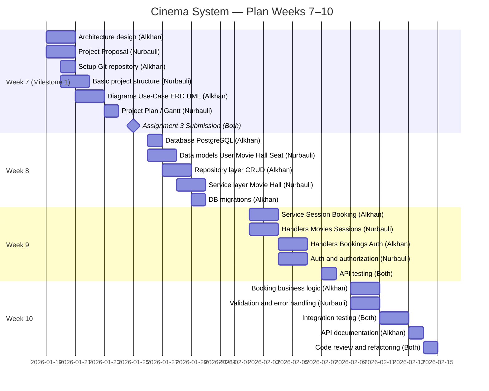

# Project Plan: Cinema System

## Team
- **Alkhan Almas** (Se-2425)
- **Nurbauli Turar** (Se-2425)

## Planning Period: Weeks 7-10

## Gantt Chart

### Visual Gantt (Mermaid)

Диаграмма отображается как график в GitHub, VS Code (с расширением Mermaid) и на [mermaid.live](https://mermaid.live). При необходимости экспортируйте в PNG.

### Week 7 (19.01 - 25.01.2026)

| Task | Responsible | Status | Duration |
|------|-------------|--------|----------|
| Architecture design | Alkhan Almas | ✅ | 2 days |
| Create Project Proposal | Nurbauli Turar | ✅ | 2 days |
| Setup Git repository | Alkhan Almas | ✅ | 1 day |
| Create basic project structure | Nurbauli Turar | ✅ | 2 days |
| Create diagrams (Use-Case, ERD, UML) | Alkhan Almas | ✅ | 2 days |
| Create Project Plan | Nurbauli Turar | ✅ | 1 day |
| **Milestone 1: Assignment 3 Submission** | **Both** | ✅ | **25.01.2026** |

### Week 8 (26.01 - 01.02.2026)

| Task | Responsible | Status | Duration |
|------|-------------|--------|----------|
| Database setup (PostgreSQL) | Alkhan Almas | ⏳ | 1 day |
| Create data models (User, Movie, Hall, Seat) | Nurbauli Turar | ⏳ | 2 days |
| Implement Repository layer (basic CRUD) | Alkhan Almas | ⏳ | 2 days |
| Implement Service layer (Movie, Hall) | Nurbauli Turar | ⏳ | 2 days |
| Create DB migrations | Alkhan Almas | ⏳ | 1 day |

### Week 9 (02.02 - 08.02.2026)

| Task | Responsible | Status | Duration |
|------|-------------|--------|----------|
| Implement Service layer (Session, Booking) | Alkhan Almas | ⏳ | 2 days |
| Implement HTTP Handlers (Movies, Sessions) | Nurbauli Turar | ⏳ | 2 days |
| Implement HTTP Handlers (Bookings, Auth) | Alkhan Almas | ⏳ | 2 days |
| Authentication and authorization system | Nurbauli Turar | ⏳ | 2 days |
| API endpoints testing | Both | ⏳ | 1 day |

### Week 10 (09.02 - 15.02.2026)

| Task | Responsible | Status | Duration |
|------|-------------|--------|----------|
| Implement booking business logic | Alkhan Almas | ⏳ | 2 days |
| Validation and error handling | Nurbauli Turar | ⏳ | 2 days |
| Integration testing | Both | ⏳ | 2 days |
| API documentation | Alkhan Almas | ⏳ | 1 day |
| Code review and refactoring | Both | ⏳ | 1 day |

## Detailed Task Distribution

### Alkhan Almas

**Week 7:**
- Overall system architecture design
- Git repository setup and branch creation
- Create Use-Case and UML diagrams
- Create basic Go project structure

**Week 8:**
- PostgreSQL setup and database connection
- Implement Repository layer for Movie and Hall
- Create and configure database migrations

**Week 9:**
- Implement Service layer for Session and Booking
- Implement HTTP Handlers for Bookings and Auth
- Authentication integration

**Week 10:**
- Implement complex booking business logic
- API documentation (Swagger/OpenAPI)
- Final testing and debugging

### Nurbauli Turar

**Week 7:**
- Write Project Proposal
- Create ERD diagram
- Create Project Plan (Gantt)
- Create basic configuration files

**Week 8:**
- Create data models (Go structures)
- Implement Service layer for Movie and Hall
- Model testing and validation

**Week 9:**
- Implement HTTP Handlers for Movies and Sessions
- Implement authentication system
- Create authorization middleware

**Week 10:**
- Input data validation
- Error handling and error handler creation
- Integration testing
- Code review and optimization

## Critical Paths

1. **Week 7**: Completion of Assignment 3 (Milestone 1)
   - All documents must be ready by 25.01.2026
   - Git repository must be set up with commits from both participants

2. **Week 8**: Infrastructure Setup
   - Database must be set up at the beginning of the week
   - Data models must be ready before Repository implementation

3. **Week 9**: Core Functionality
   - Authentication must be implemented before protected endpoints
   - Service layer must be ready before Handlers

4. **Week 10**: Integration and Testing
   - All modules must be integrated
   - Testing must identify critical bugs before final submission

## Risks and Mitigation

| Risk | Probability | Impact | Mitigation |
|------|-------------|--------|------------|
| Database setup delay | Medium | High | Start DB setup at the beginning of week 8 |
| Booking business logic complexity | Medium | Medium | Prototype logic in advance |
| Git conflicts | Low | Low | Regular synchronization and code review |
| Insufficient testing | Medium | High | Allocate sufficient time for testing in week 10 |

## Success Metrics

- ✅ Assignment 3 submitted on time (25.01.2026)
- ⏳ All main modules implemented by end of week 9
- ⏳ API fully functional and tested
- ⏳ Code passes code review without critical issues
- ⏳ API documentation completed

## Notes

- Final polish tasks are not included in this plan as they will be defined later
- Plan may be adjusted depending on progress
- Regular team synchronization planned 2 times per week
- Code review will be conducted before merging to main branch
