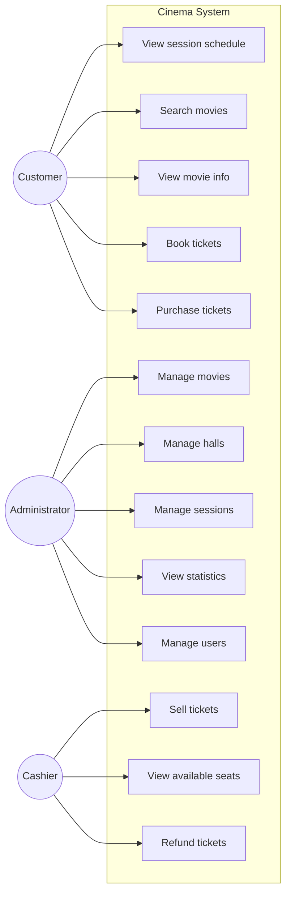
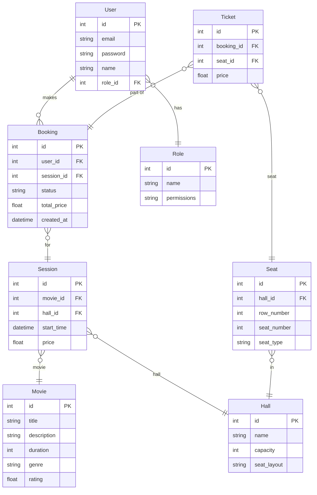
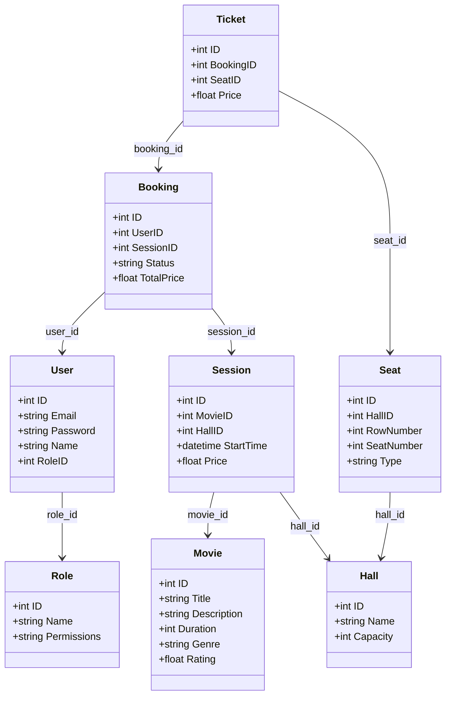
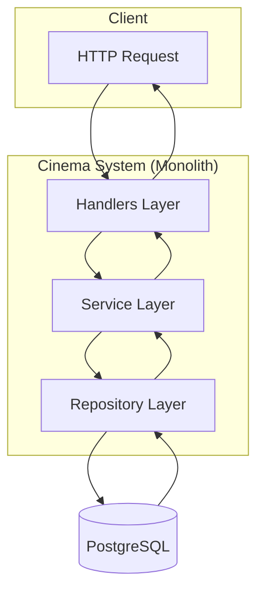

# Диаграммы (Mermaid)

Диаграммы ниже отображаются как графики в **GitHub**, **VS Code** (расширение Mermaid) и на [mermaid.live](https://mermaid.live).  
Для экспорта в PNG: скопируйте код блока на [mermaid.live](https://mermaid.live) → Export → PNG.

---

## 1. Use-Case Diagram



---

## 2. ERD (Entity Relationship Diagram)



---

## 3. UML Class Diagram (Models + Services + Repositories)



---

## 4. System Architecture (Layers)



---

## 5. Data Flow: Ticket Booking

```mermaid
sequenceDiagram
    participant C as Client
    participant H as BookingHandler
    participant S as BookingService
    participant R as BookingRepository
    participant DB as Database

    C->>H: POST /api/bookings
    H->>H: Validate request
    H->>S: CreateBooking(...)
    S->>S: Check session & seats
    S->>R: Create booking + tickets
    R->>DB: BEGIN; INSERT; COMMIT
    DB-->>R: OK
    R-->>S: Booking
    S-->>H: Booking
    H-->>C: 201 Created
```
